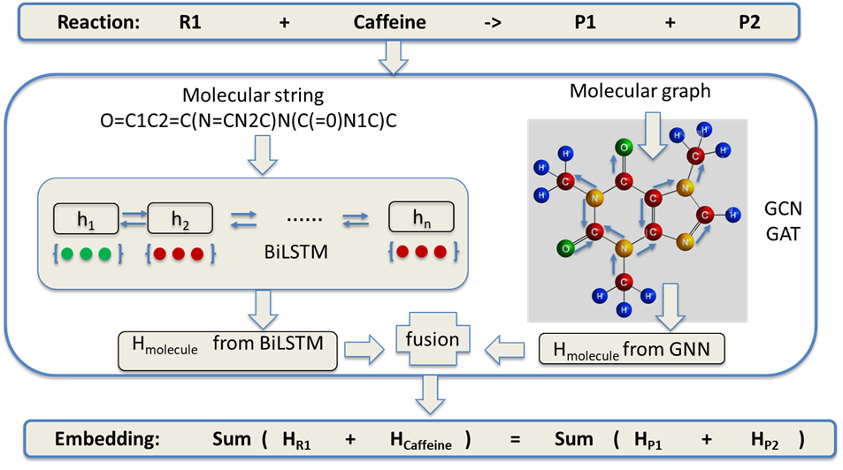
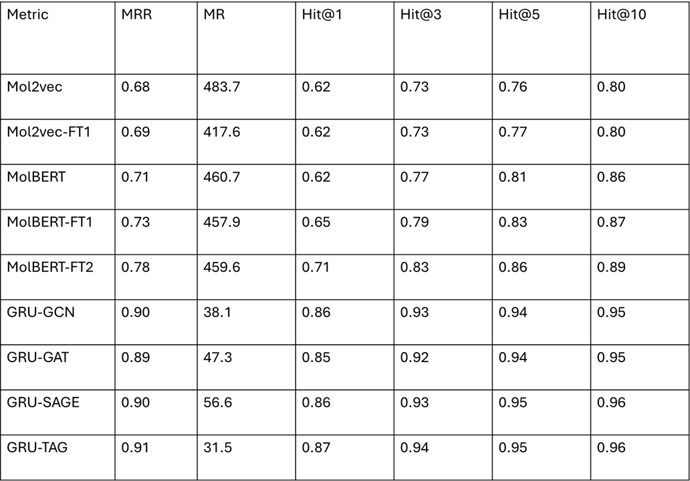
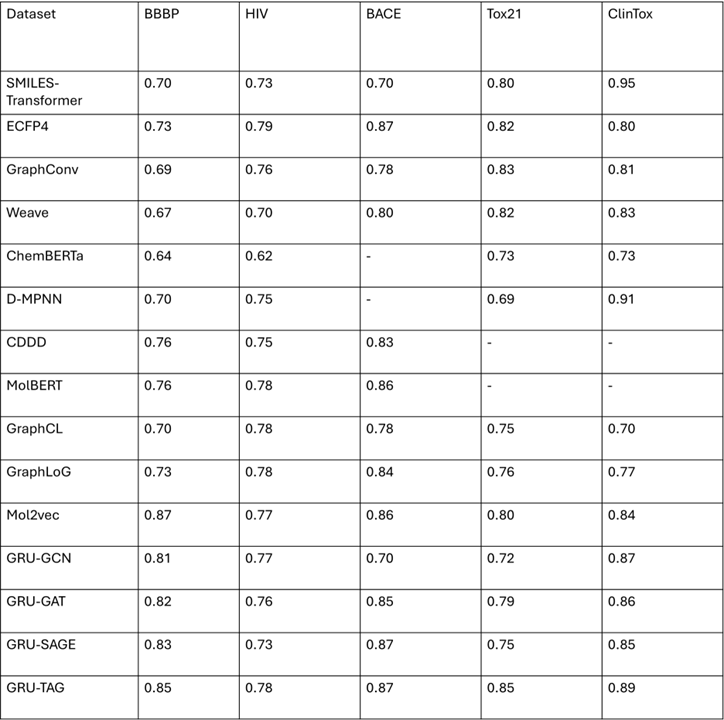
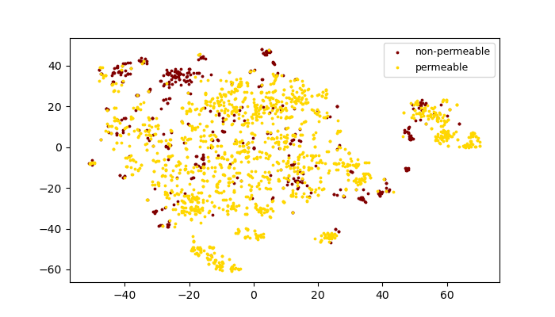

# 

This work is based on two papers:
> ([paper](https://openreview.net/forum?id=6sh3pIzKS-))
> Chemical-Reaction-Aware Molecule Representation Learning
> ([paper](https://dl.acm.org/doi/10.1145/3340531.3411981)):
> GraSeq: Graph and Sequence Fusion Learning for Molecular Property Prediction 

This work uses graph neural networks (GNNs) and RNN as the molecule encoder, and preserves the equivalence of molecules w.r.t. chemical reactions in the embedding space.
The model architecture is shown below with four versions: GRU-GCN. GRU-GAT, GRU-SAGE, GUR-TAG:

Below is the result of reaction prediction task on USPTO:

Below is the result of AUC on BBBP, HIV, and BACE datasets for the task of molecule property prediction:

Below is the visualized molecule embedding space on BBBP dataset using t-SNE:

For more details about the dataset, please refer to the paper: Chemical-Reaction-Aware Molecule Representation Learning.
The cache of preprocessed data is too large to upload, please run pretrain task first to process the data using: python main.py -- force_preprocess
### Files in the folder

- `data/`
  - `BBBP/` for molecule property prediction and visualization
  - `BACE/` for molecule property prediction
  - `Tox21/` for molecule property prediction
  - `ClinTox/` for molecule property prediction
- `src/`
  - `ged_pred/`: code for graph-edit-distance prediction task
  - `property_pred/`: code for molecule property prediction task
  - `visualization/`: code for embedding visualization task
  - `new_data_processing.py`: processing USPTO-479k dataset
  - `main.py`: main function
  - `model.py`: implementation of GNNs
  - `train.py`: training procedure on USPTO-479k dataset
- `saved/` (pretrained models with the name format of `gnn_dim`)
  - `gat_512/`
  - `gcn_512/`
  - `sage_512/`
  - `tag_512/`

### Required packages

The code has been tested running under Python 3.7 and CUDA 11.0, with the following packages installed (along with their dependencies):

- torch == 1.8.1
- dgl-cu110 == 0.6.1 (can also use dgl == 0.6.1 if run on CPU only)
- pysmiles == 1.0.1
- scikit-learn==0.24.2
- networkx==2.5.1
- matplotlib==3.4.2 (for `--task=visualization`)
- openbabel==3.1.1 (for `--task=visualization` and `--subtask=ring`)
- scipy==1.7.0
